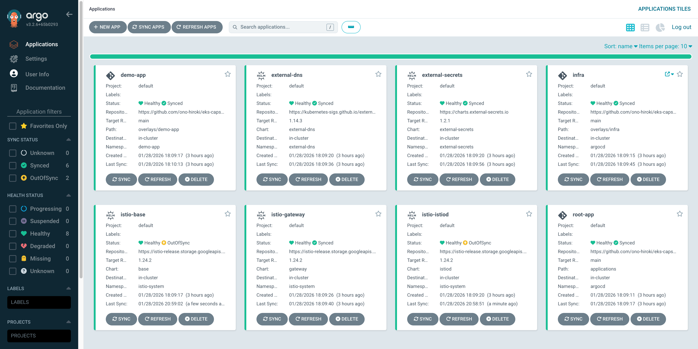

# EKS Capstone Base

EKS Capstone Project の Kustomize ベースリポジトリです。

このリポジトリは公開用のベースマニフェストを提供します。環境固有の値（ドメイン、ACM ARN、IAM ロール ARN など）はプレースホルダーになっており、オーバーレイリポジトリで Kustomize patches を使って上書きします。

## ディレクトリ構成

```
eks-capstone-base/
├── terraform/              # Terraform 設定（VPC, EKS, IAM, ACM）
├── app/                    # デモアプリ（Dockerfile, HTML）
├── scripts/                # bootstrap.sh, cleanup.sh
└── gitops/
    └── base/
        ├── apps/
        │   └── demo-app/   # デモアプリのマニフェスト
        └── infra/          # インフラ系マニフェスト（Istio, ESO, etc.）
```

## インフラ構成図


## プレースホルダー一覧

オーバーレイで以下のプレースホルダーを上書きする必要があります：

### demo-app

| ファイル | プレースホルダー | 説明 |
|---------|----------------|------|
| `deployment.yaml` | `__IMAGE__` | ECR イメージ URL |
| `serviceaccount.yaml` | `__DEMO_APP_ROLE_ARN__` | demo-app 用 IAM ロール ARN |
| `clustersecretstore.yaml` | `__REGION__` | AWS リージョン |
| `gateway.yaml` | `__APP_DOMAIN__` | アプリのドメイン名 |
| `virtualservice.yaml` | `__APP_DOMAIN__` | アプリのドメイン名 |

### infra

| ファイル | プレースホルダー | 説明 |
|---------|----------------|------|
| `external-secrets-sa.yaml` | `__ESO_ROLE_ARN__` | External Secrets 用 IAM ロール ARN |
| `external-dns.yaml` | `__REGION__` | AWS リージョン |
| `external-dns.yaml` | `__HOSTED_ZONE_NAME__` | Route 53 ホストゾーン名 |
| `external-dns.yaml` | `__EXTERNAL_DNS_ROLE_ARN__` | External DNS 用 IAM ロール ARN |
| `istio-ingress.yaml` | `__APP_ACM_CERTIFICATE_ARN__` | アプリ用 ACM 証明書 ARN |
| `istio-ingress.yaml` | `__APP_DOMAIN__` | アプリのドメイン名 |
| `argocd-ingress.yaml` | `__ARGOCD_ACM_CERTIFICATE_ARN__` | Argo CD 用 ACM 証明書 ARN |
| `argocd-ingress.yaml` | `__ARGOCD_DOMAIN__` | Argo CD のドメイン名 |

## 使い方

### 1. オーバーレイリポジトリを作成

```bash
mkdir my-eks-capstone
cd my-eks-capstone
git init
```

### 2. ディレクトリ構成を作成

```
my-eks-capstone/
├── applications/
│   ├── root-application.yaml
│   ├── infra-application.yaml
│   └── demo-app-application.yaml
├── overlays/
│   ├── infra/
│   │   ├── kustomization.yaml
│   │   └── patches/
│   │       ├── external-dns-patch.yaml
│   │       ├── external-secrets-sa-patch.yaml
│   │       ├── istio-ingress-patch.yaml
│   │       └── argocd-ingress-patch.yaml
│   └── demo-app/
│       ├── kustomization.yaml
│       └── patches/
│           ├── deployment-patch.yaml
│           ├── serviceaccount-patch.yaml
│           ├── clustersecretstore-patch.yaml
│           ├── gateway-patch.yaml
│           └── virtualservice-patch.yaml
└── terraform/
    └── terraform.tfvars
```

### 3. Kustomization でリモートベースを参照

```yaml
# overlays/demo-app/kustomization.yaml
apiVersion: kustomize.config.k8s.io/v1beta1
kind: Kustomization

resources:
  - https://github.com/ono-hiroki/eks-capstone-base.git//gitops/base/apps/demo-app?ref=main

images:
  - name: __IMAGE__
    newName: 123456789012.dkr.ecr.ap-northeast-1.amazonaws.com/capstone-demo
    newTag: v1

patches:
  - path: patches/serviceaccount-patch.yaml
  - path: patches/clustersecretstore-patch.yaml
  - path: patches/gateway-patch.yaml
  - path: patches/virtualservice-patch.yaml
```

### 4. パッチファイルの例

```yaml
# overlays/demo-app/patches/gateway-patch.yaml
apiVersion: networking.istio.io/v1
kind: Gateway
metadata:
  name: demo-app-gateway
  namespace: demo-app
spec:
  servers:
    - hosts:
        - "app.your-domain.com"
```

### 5. ビルド確認

```bash
kubectl kustomize overlays/demo-app
```

## Terraform

`terraform/` ディレクトリには以下のリソースを作成する Terraform 設定が含まれています：

- VPC / Subnet
- EKS クラスタ
- IAM Role / Policy（IRSA）
- ACM 証明書

使用前に `terraform.tfvars.example` をコピーして `terraform.tfvars` を作成し、自分の環境の値を設定してください。

## デモアプリ

`app/` ディレクトリには nginx ベースのシンプルなデモアプリが含まれています。

デプロイされたアプリは以下のような画面を表示します。ConfigMap や External Secrets Operator 経由で取得した値が確認できます。


```bash
cd app
docker build -t capstone-demo:v1 .
```

## Argo CD

GitOps によるデプロイは Argo CD で管理されます。App of Apps パターンを採用しており、以下のアプリケーションが自動的にデプロイされます。



## スクリプト

| スクリプト | 説明 |
|-----------|------|
| `scripts/bootstrap.sh` | EKS クラスタの初期セットアップ（ALB Controller, Argo CD） |
| `scripts/cleanup.sh` | リソースのクリーンアップ |

## 関連リンク

- [Kustomize - Remote Targets](https://kubectl.docs.kubernetes.io/references/kustomize/kustomization/resource/)
- [Argo CD - Kustomize](https://argo-cd.readthedocs.io/en/stable/user-guide/kustomize/)
